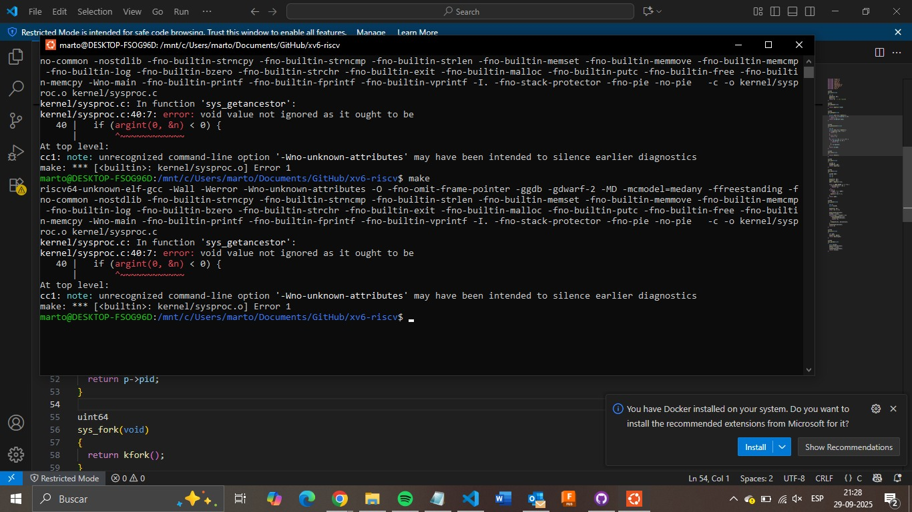
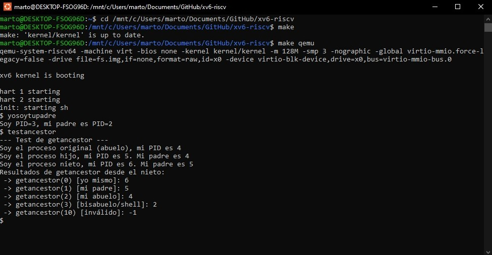

# TAREA 1 Sistemas operativos Sec 2

## **Integrantes**

- **Martin Peralta**  
  <martperalta@alumnos.uai.cl>

- **Cristobal Zeballos**  
  <czeballos@alumnos.uai.cl>

## Descripción
El objetivo de esta tarea fue implementar dos nuevas llamadas al sistema en xv6 para interactuar con la jerarquía de procesos.

La primera, **`getppid(void)`**, es una llamada simple que retorna el ID del proceso padre del proceso actual. La segunda, **`getancestor(int)`**, es una llamada más avanzada que recibe un entero `level` y retorna el PID del ancestro correspondiente a ese nivel (0 para sí mismo, 1 para el padre, etc.), devolviendo -1 si el ancestro no existe.

---
## Archivos Modificados

### Parte I: Implementación de `getppid(void)`
- `kernel/syscall.h`: se agregó la constante `SYS_getppid`.
- `kernel/syscall.c`: se agregó la entrada correspondiente en la tabla de llamadas.
- `kernel/sysproc.c`: se implementó la función `sys_getppid` .
- `user/user.h`: se agregó el prototipo de `int getppid(void);`.
- `user/usys.pl`: se añadió la entrada para generar el wrapper en `usys.S` para que sea mas fácil desde el usuario.
- `user/yosoytupadre.c`: programa de prueba que muestra el PID del proceso y de su padre.

### Parte II: Implementación de `getancestor(int)`
- `kernel/syscall.h`: se agregó la constante `SYS_getancestor`.
- `kernel/syscall.c`: se agregó la entrada en la tabla de llamadas para `sys_getancestor`.
- `kernel/sysproc.c`: se implementó la lógica de la función `sys_getancestor` para recorrer el árbol de procesos.
- `user/user.h`: se agregó el prototipo de `int getancestor(int);`.
- `user/usys.pl`: se añadió la entrada para `getancestor` para generar el código intermediario.
- `Makefile`: se incluyó el nuevo programa de prueba `_testancestor` en la lista `UPROGS`.
- `user/testancestor.c`: se creó un programa de prueba para verificar el correcto funcionamiento de `getancestor` con múltiples niveles de ascendencia.

---
## Pruebas y Dificultades

Durante la implementación de la parte II, se encontró un error de sintaxis en `kernel/sysproc.c` al copiar la función, omitiendo su firma (`uint64 sys_getancestor(void)`). Esto provocó un fallo de compilación que fue identificado y corregido rápidamente.

A continuación, se muestra una captura del error encontrado:

Una vez corregido, el programa de prueba `testancestor` se ejecutó exitosamente, validando todos los casos de uso, incluyendo la búsqueda en múltiples niveles y el manejo de errores:

---
## Conclusiones

A través de esta tarea, logramos comprender y aplicar el proceso completo para extender el kernel de xv6 con nuevas llamadas al sistema y mucho más complejas que en la tarea anterior. La implementación de **`getppid`** sirvió como una excelente introducción al mecanismo, mientras que **`getancestor`** fue desafiente al tener qeu implementar una lógica más compleja de recorrido en el árbol de procesos y manejo de casos límite.

En el proceso, reforzamos la importancia de modificar correctamente cada archivo relevante, desde la declaración de la llamada en el kernel (`syscall.h`) hasta la interfaz expuesta al usuario (`user.h`). Esto nos permitió visualizar de manera práctica cómo las llamadas al sistema actúan como el puente fundamental entre los programas de usuario y el kernel, permitiendo un acceso controlado y seguro a los recursos y a la información interna del sistema operativo.