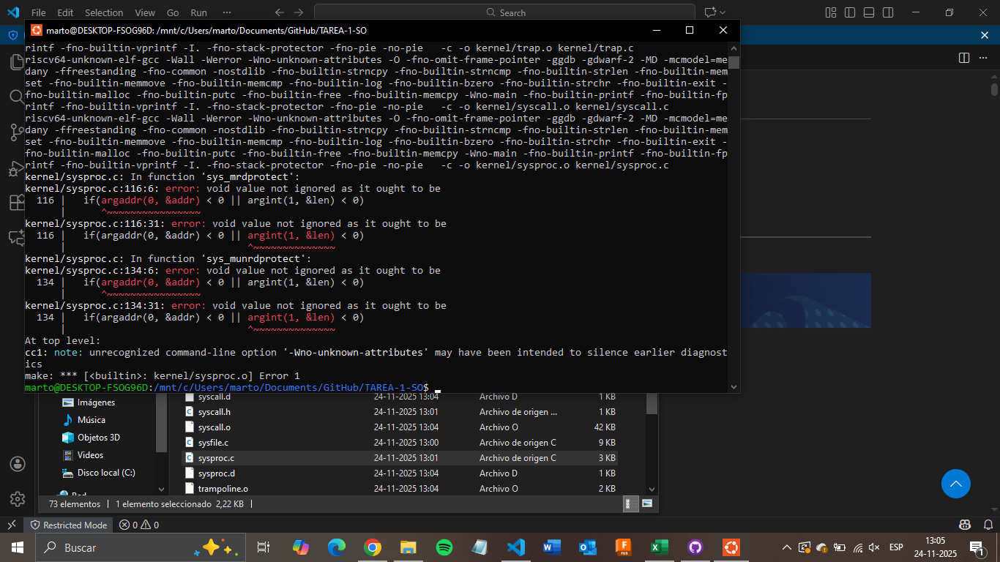
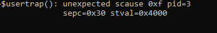

# TAREA 3 Sistemas Operativos Sec 2

## **Integrantes**

- **Martin Peralta**  
  <martperalta@alumnos.uai.cl>

- **Cristobal Zeballos**  
  <czeballos@alumnos.uai.cl>

## Descripción
El objetivo de esta tarea fue implementar un mecanismo de protección de memoria "Write-Only" en el sistema xv6. Este tipo de protección es útil en contextos de seguridad, donde se requiere escribir datos sensibles en una región de memoria, pero es clave impedir que sean leídos posteriormente para evitar fugas de información.

Para lograr esto, se modificó el kernel para manipular directamente los bits de permisos en la Tabla de Páginas (*Page Table Entries*). Se implementaron dos nuevas llamadas al sistema:

1.  **`mrdprotect(void *addr, int len)`**: Revoca el permiso de lectura (`PTE_R`) de las páginas correspondientes al rango indicado, manteniendo activos los permisos de escritura y validez.
2.  **`munrdprotect(void *addr, int len)`**: Restaura el permiso de lectura en las páginas afectadas, volviendo a encender el bit `PTE_R`.

---
## Archivos Modificados

### Parte I: Lógica de Memoria Virtual (`kernel/vm.c`)
Se implementó la función auxiliar **`uvm_protect(uint64 va, uint64 len, int enable_read)`**.
- Esta función es la base de la tarea. Utiliza la función `walk()` para recorrer la tabla de páginas del proceso actual y localizar la PTE correspondiente a cada dirección virtual.
- Realiza validaciones de robustez: verifica que la página esté mapeada (`PTE_V`), sea accesible por el usuario (`PTE_U`) y que la dirección esté alineada.
- Modifica los bits de permisos:
    - Si `enable_read` es 0: Ejecuta `*pte &= ~PTE_R` (Apaga lectura).
    - Si `enable_read` es 1: Ejecuta `*pte |= PTE_R` (enciende lectura).

### Parte II: Implementación de Syscalls (`kernel/sysproc.c`)
Se añadieron las funciones **`sys_mrdprotect`** y **`sys_munrdprotect`**.
- Estas funciones operan como interfaz entre el usuario y el kernel.
- Reciben los argumentos `addr` (dirección) y `len` (longitud).
- Llaman a `uvm_protect` con los parámetros adecuados.
- **Punto Crítico:** Ejecutan **`sfence_vma()`** al finalizar. Esto es fundamental para limpiar la TLB, asegurando que el procesador olvide las traducciones de memoria antiguas y aplique los nuevos permisos inmediatamente.

### Parte III: Definiciones y Enlaces
- **`kernel/defs.h`**: Se declaró el prototipo de `uvm_protect` para hacerlo visible globalmente.
- **`kernel/syscall.h`**: Se asignaron los números de syscall `SYS_mrdprotect` y `SYS_munrdprotect`.
- **`kernel/syscall.c`**: Se registraron las nuevas llamadas en la tabla de despacho.
- **`user/user.h`** y **`user/usys.pl`**: Se expusieron las funciones al espacio de usuario y se generaron los stubs en ensamblador.

### Parte IV: Probar en sistema
- **`user/rdprotect_test.c`**: Se creó un programa de prueba que solicita una página de memoria, escribe un valor, la protege usando `mrdprotect`, intenta escribir nuevamente (para probar que sea Write-Only) y finalmente intenta leer (esperando un fallo).

---
## Pruebas y Dificultades

Durante el desarrollo de esta tarea, como grupo nos enfrentamos a dos complicaciones principales que requirieron un análisis detallado:

**1. Incompatibilidad de Tipos en `sysproc.c`**
Al inicio, implementamos la obtención de argumentos en `sysproc.c` siguiendo la documentación estándar, intentando verificar el retorno de `argint` y `argaddr` dentro de una sentencia `if`. Sin embargo, el compilador arrojó el error: *"void value not ignored as it ought to be"*. Tras revisar el código fuente de nuestra distribución específica de xv6, descubrimos que las funciones `argint` y `argaddr` estaban definidas como tipo `void` (no retornan valor) y manejan los errores internamente terminando el proceso. La solución fue modificar la implementación para llamar a estas funciones directamente, sin comprobación condicional de retorno.

**2. Limitación de Hardware RISC-V (Trap en Write-Only)**
Al ejecutar el programa de prueba `rdprotect_test`, observamos que la protección funcionaba, pero de una manera inesperada. El sistema lanzaba un `usertrap` con **`scause 0xf` (Store/AMO Page Fault)** al intentar *escribir* en la memoria protegida, en lugar de permitir la escritura y fallar solo en la lectura.

Tras investigar la especificación de la arquitectura RISC-V (utilizada por xv6 y QEMU), confirmamos que la combinación de bits **Escritura=1 y Lectura=0** (`PTE_W=1`, `PTE_R=0`) es tratada por el hardware estándar como un estado reservado. Por seguridad, la MMU lanza una excepción al acceder a una página con esta configuración, incluso si la operación es de escritura. Esto confirmó que nuestra implementación lógica era correcta (el bit de lectura se apagó exitosamente), aunque el hardware impidiera el comportamiento teórico de "solo escritura".

---
## Conclusiones

Esta tarea nos permitió comprender a fondo cómo el sistema operativo gestiona la memoria virtual a través de la manipulación de bits en la Tabla de Páginas. Aprendimos que la seguridad en memoria no es abstracta, sino que depende de configuraciones específicas (bits R/W/X) que el hardware verifica en cada ciclo de acceso.

Un aprendizaje clave fue la importancia de la coherencia entre la memoria y la caché del procesador (TLB). Sin el uso de `sfence_vma()`, los cambios en la tabla de páginas no tendrían efecto inmediato, lo que podría generar graves fallos de seguridad.

Finalmente, la dificultad encontrada con el hardware RISC-V fue incialmente frustrante pero finalmente nos dejo un aprendizaje mas, ya que nos demostró que el desarrollo de Sistemas Operativos no solo depende de la lógica del software (Kernel), sino que está limitado por las reglas y especificaciones del hardware (arquitectura de este) sobre la que se ejecuta.